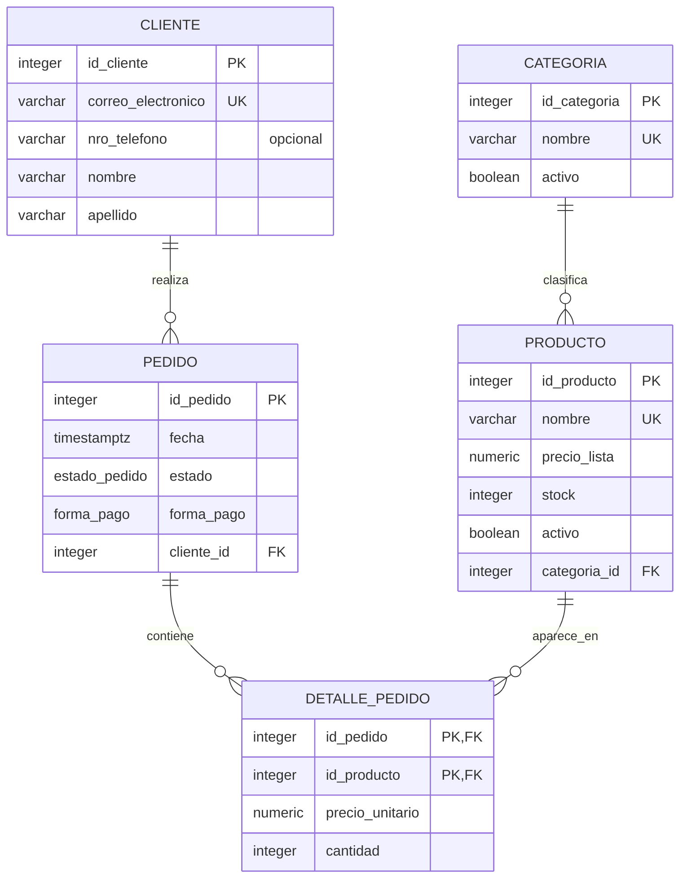

# Modelo ER y transformación al modelo relacional

Versión correspondiente a la primera entrega parcial del TPI. Describe el esquema efectivamente implementado en [schema.sql](../schema.sql). La persona que compra se denomina **cliente**; no existe una tabla adicional usuario. Esta versión reemplaza para la entrega integradora las representaciones preliminares del TP1 que no coincidían con el DDL.

## Entidades y relaciones del dominio

Cliente identifica a la persona que realiza pedidos. Pedido registra fecha, estado y forma de pago. Producto pertenece a una categoría y tiene precio de lista, stock y vigencia. Categoría clasifica productos y tiene su propia vigencia. La relación N:M «pedido contiene producto» tiene dos atributos: cantidad y precio_unitario de la venta. Se representa mediante la entidad asociativa DetallePedido.



`||` significa exactamente uno; `o{`, cero o muchos. Las dos marcas PK en detalle forman **una clave primaria compuesta**, no dos claves independientes. Cantidad y precio de venta pertenecen a la relación pedido–producto, no a categoría ni a cliente.

## Cardinalidad y participación

| Relación conceptual | Cardinalidad y mínimos | Participación que garantiza el DDL |
|---|---|---|
| Cliente realiza Pedido | Cliente 0..N pedidos; Pedido 1 cliente | Cliente parcial; Pedido total, por FK NOT NULL |
| Categoría clasifica Producto | Categoría 0..N productos; Producto 1 categoría | Categoría parcial; Producto total, por FK NOT NULL |
| Pedido contiene Producto | N:M; cada lado puede no tener asociaciones | Se resuelve con DetallePedido; ambas FK son obligatorias en cada detalle |
| Pedido tiene DetallePedido | Pedido 0..N detalles; Detalle 1 pedido | Pedido parcial en el modelo; Detalle total |
| Producto aparece en DetallePedido | Producto 0..N detalles; Detalle 1 producto | Producto parcial; Detalle total |

La tabla admite pedidos vacíos: existen en el seed y se prueban con total cero. El procedimiento de alta ofrece un contrato más estricto —al menos una línea—, pero eso no convierte el mínimo del modelo general en uno. No se afirma que los triggers impidan confirmar un pedido vacío, porque esa regla no está implementada.

## Paso al modelo relacional

Cada entidad fuerte produce su tabla con una PK IDENTITY. Las claves naturales declaradas UNIQUE se conservan como claves alternativas.

```text
CATEGORIA(id_categoria PK, nombre UK, activo)
CLIENTE(id_cliente PK, correo_electronico UK, nro_telefono?, nombre, apellido)
PRODUCTO(id_producto PK, nombre UK, precio_lista, stock, activo,
         categoria_id FK -> CATEGORIA.id_categoria)
PEDIDO(id_pedido PK, fecha, estado, forma_pago,
       cliente_id FK -> CLIENTE.id_cliente)
DETALLE_PEDIDO(id_pedido PK/FK -> PEDIDO.id_pedido,
               id_producto PK/FK -> PRODUCTO.id_producto,
               precio_unitario, cantidad)
```

1. En Cliente–Pedido (1:N), la FK `cliente_id` se coloca en el lado N: Pedido. No hay `pedido_id` en Cliente.
2. En Categoría–Producto (1:N), `categoria_id` se coloca en Producto. No hay `producto_id` en Categoría.
3. En Pedido–Producto (N:M), DetallePedido incorpora las dos FK y sus atributos propios. La PK `(id_pedido,id_producto)` permite un solo renglón por producto dentro de un pedido; cantidad expresa las unidades.
4. Los mínimos de participación del lado dependiente se traducen a FK NOT NULL. `ON DELETE RESTRICT` conserva referencias; la baja comercial usa `activo=false` cuando corresponde.
5. Estado y forma de pago se convierten en tipos ENUM, no en booleanos ni tablas nuevas. Comidas/bebidas/postres son posibles **filas** de Categoría, no atributos del modelo.

## Diccionario de atributos

Todos los atributos son NOT NULL salvo `cliente.nro_telefono`. Los identificadores de entidades fuertes son `INTEGER GENERATED ALWAYS AS IDENTITY`; la clave del detalle se obtiene de las entidades que relaciona.

| Tabla | Atributos y dominio |
|---|---|
| categoria | id_categoria INTEGER; nombre VARCHAR(50) único; activo BOOLEAN, predeterminado TRUE |
| cliente | id_cliente INTEGER; correo_electronico VARCHAR(150) único; nro_telefono VARCHAR(30) opcional; nombre VARCHAR(50); apellido VARCHAR(50) |
| producto | id_producto INTEGER; nombre VARCHAR(100) único; precio_lista NUMERIC(10,2) ≥ 0; stock INTEGER ≥ 0, predeterminado 0; activo BOOLEAN, predeterminado TRUE; categoria_id INTEGER FK |
| pedido | id_pedido INTEGER; fecha TIMESTAMPTZ, predeterminado CURRENT_TIMESTAMP; estado ENUM, predeterminado PENDIENTE; forma_pago ENUM; cliente_id INTEGER FK |
| detalle_pedido | id_pedido INTEGER FK; id_producto INTEGER FK; precio_unitario NUMERIC(10,2) ≥ 0; cantidad INTEGER > 0 |

`estado_pedido`: PENDIENTE, CONFIRMADO, ENTREGADO, CANCELADO. `forma_pago`: EFECTIVO, TARJETA, TRANSFERENCIA. El teléfono se trata como texto, conservando prefijos y ceros. El correo es una clave alternativa según la igualdad de VARCHAR configurada; no se afirma unicidad sin distinguir mayúsculas. El nombre de producto sigue siendo único incluso después de una baja.

`precio_lista` representa el catálogo actual; `precio_unitario`, el importe unitario pactado en esa venta. El segundo no se recalcula al cambiar el catálogo. No se almacena total de pedido: [tpi_total_pedido](funciones.sql) lo obtiene desde sus detalles. `stock` limita cada línea; el sistema heredado no reserva ni descuenta existencias automáticamente.
